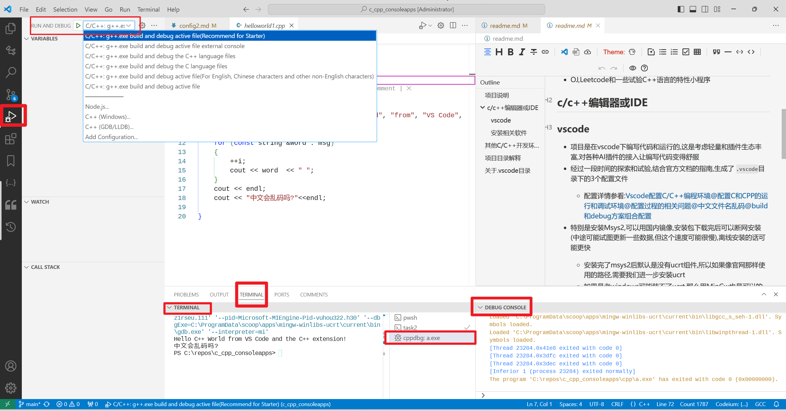

[toc]


## 项目说明

- 简单的c/c++程序集合
- 存放的源代码编译出来都是控制台程序Console apps
- OJ,Leetcode和一些试验C++语言的特性小程序

## c/c++编辑器或IDE

### vscode

- 项目是在vscode下编写代码和运行的,这是考虑轻量和插件生态丰富,对各种AI插件的接入让编写代码变得舒服
- 经过一段时间的探索和试验,结合官方文档的指南,生成了`.vscode`目录下的3个配置文件
  - 配置详情参看:[Vscode配置C/C++编程环境@配置C和CPP的运行和调试环境@配置过程的相关问题@中文文件名乱码@build和debug方案组合配置](https://blog.csdn.net/xuchaoxin1375/article/details/138172679)

## 配置

- vscode c/c++相关插件和推荐插件写在`.vscode/extensions.json`中,vscode如果检测到你没有安装相应插件,回提示你安装
- 也可以使用profile(导入配置,文件位于`.vscode/C-C++ consoleApps_share.code-profile`),通过设置->profile->导入profile会创建一个专门和C/C++相关的插件环境,其他插件不会加载

### 安装相关软件

- 您可以到官方网站下载vscode,或者其他vscode镜像加速下载(如果官网下载的慢的话);编译器也可通过间接安装,也可以直接安装(镜像加速下载)

- 此外,如果您愿意,我推荐windows用户使用scoop(国内版加速)来快速部署c++/c编程环境

  - 只需要一条命令梭哈所有需要的软件`gcc gdb vscode `(如果需要,可以追加一个`git`,虽然使用scoop一般都有了git环境)

    ```
    scoop install  gcc gdb vscode # 如果需要为所有用户安装,那需要用管理员执行,此命令追加选项 -g
    ```

    - 安装完成的瞬间,就可以直接在命令行中访问`g++,gcc,gdb,code`命令或工具了

  - 再启动vscode 下载相关插件,然后打开克隆本项目到本地,直接用vscode打开此文件夹即可

## 其他C/C++开发环境

- 轻量的小熊猫redpanda-cpp,有开箱即用的版本,一样可以用scoop安装(是轻量版本,配合上述的)

  ```cmd
  scoop install redpanda-cpp
  ```

- 重量的vs(visual studio)对中文支持良好,不会有乱码的问题

## 项目目录解释

- 01目录是北京大学 郭炜 编著的 新标准C++程序设计
  - [清华大学出版社-图书详情-《新标准C++程序设计教程》 (tsinghua.edu.cn)](http://www.tup.tsinghua.edu.cn/bookscenter/book_04562004.html)
  - 这里所谓的新标准已经不是什么新标准了,仅是相对于C++98而言较新的C++11

- 02目录是国外的JumpIntoCpp的源码
  - [Jumping into C++, by Alex Allain - Cprogramming.com](https://www.cprogramming.com/c++book/?inl=bg1)
  - 虽然是收费的,但是有资源

## 关于.vscode目录

使用符号链接定位到两个.vscode版本:`.vscode.bak1`和`.vscode.bak2`

例如切换到`.vscode.bak1`执行以下命令

```powershell
 New-Item -ItemType SymbolicLink -Path .vscode -Target .vscode.bak1 -Force -Verbose
```

执行成功后,刷新以下文件列表,可以看到`.vscode`内容的变化

## 使用过程记录截图


### git(gitee/github)在线浏览

图片存在仓库中,防止外部图片丢失的备份


